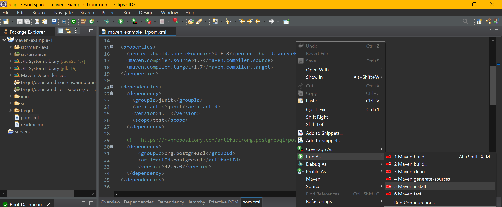

# Maven Example 1

<!-- TOC -->

- [0. ¿Qué es Maven?](#%C2%BFqu%C3%A9-es-maven)
- [1. Crear el proyecto](#crear-el-proyecto)
- [2. Update Project](#update-project)
- [3. Ejecución del proyecto](#ejecuci%C3%B3n-del-proyecto)
- [4. pom.xml --> Dependencias](#pomxml----dependencias)
- [5. Ejemplo Maven MVC por consola](#ejemplo-maven-mvc-por-consola)

<!-- /TOC -->

# 0. ¿Qué es Maven?

Maven es una herramienta para la gestión de proyectos, que nos permitirá administrar completamente el ciclo de vida de la misma. Comúnmente se conoce a Maven como un gestor de dependencias Y YA. Y eso no es del todo cierto. Podemos considerarlo como una herramienta de construcción con muchas características, que nos ayuda a gestionar las dependencias, test, documentación, compilaciones, distribuciones e incluso los mailing list.

¿Qué es lo que Maven puede hacer por nosotros? En muy resumidas cuentas, lo siguiente:

- Build. Construye nuestro código fuente del proyecto

- Test. Ejecuta los casos de prueba
- Gestiona las dependencias de nuestro proyecto. Es cierto que no es sólo un gestor, pero para mi es de lo mejor que tiene Maven. Importa las librerías automáticamente desde un repositorio remoto. Nos podemos olvidar de hacer esa tarea manualmente.

- Permite la creación y descarga de plantillas de proyectos para tener la estructura ya creada. Por ejemplo si nos vamos a dedicar a hacer páginas web, o conectores, nos interesará para ahorrarnos el trabajo de tener que empezar desde cero una y otra vez

- Crea una web con la documentación del proyecto

- Desplega el proyecto (AKA artefacto) en servidor

- Y por supuesto, perfecta integración con Git, SVN, Jira...

Conceptos de vocabulario:

- artefacto. Es un proyecto que lo gestiona Maven y que incluye un fichero llamado pom.xml.

- POM. Son las siglas de Project Object Model. Es un fichero XML que contiene la configuración del artefacto. Más adelante trabajaremos con él. Si has programado en Android anteriormente, un símil adecuado sería el AndroidManifest.

- groupId. El identificador único para crear nuestro artefacto. Se suele poner el mismo que en un paquete java. com.programandoapasitos

# 1. Crear el proyecto


# 2. Update Project

**Nota**: Ya hemos añadido antes nuestro JDK19 al *build path*, así que no tenemos que tocar el *pom.xml* para que Maven reconozca nuestro java... porque en el pom ya viene el plugin de 
```xml
<artifactId>maven-compiler-plugin</artifactId>
```


# 3. Ejecución del proyecto

La opción de *Run as ...* se nos subdivide en las siguientes opciones:

- Maven build → Compila el código del proyecto

- Maven clean → Elimina todos los ficheros hechos por los builds anteriores

- Maven generate-sources → Genera código para incluirlo en la compilación

- Maven install → Instala los paquetes de la biblioteca en un repositorio local, compila el proyecto y lo comprueba.


# 4. pom.xml --> Dependencias


Para gestionar las dependencias, dentro del POM deberemos fijarnos en el tag dependencies.
Por defecto tenemos cargada la librería de junit, que nos servirá para ver un ejemplo de cómo añadir más librerías.

Tenemos, al igual que con los plugin, los tag de groupId y artifactId. Aparte de eso, lo que nos interesa también es el tercer tag, version, que nos permitirá indicar la versión de la librería y, en caso de tener que modificarla, bastará con cambiar ese valor y volver a hacer un install.

¿de dónde podemos conseguir las dependencias?

Hay varios sitios y Google lo sabe todo, pero así más concretamente hay una página web llamada MVN Repository (https://mvnrepository.com/) que cuenta con un amplio abanico de dependencias organizadas por temas que es de lo mejorcito que podemos encontrar.

Simplemente entraremos en la dependencia que nos interese, por ejemplo el conector JDBC de MySQL, elegiremos la versión que queramos cargar en nuestro proyecto y en la parte inferior de la página nos aparecerá el código XML de Maven que deberemos copiar en el POM.


Y después de hacer un Maven install ya estaremos en disposición de usar nuestra nueva dependencia del driver de PostgreSQL.



# 5. Ejemplo Maven MVC por consola

Para ver si la dependencia del driver de PostgreSQL funciona correctamente, se me ha ocurrido replicar en este artefacto, la última práctica que hicimos en clase, la cual realizaba una consulta insert y después un select para mostrar el resultado por consola.

Como ya he desarrollado esa práctica en repositorios anteriores, no entraré en detalle otra vez aquí, si no que volveré a crear los paquetes y las clases y le daré al botón del *play* (run as java application)... y funciona todo perfectamente!


